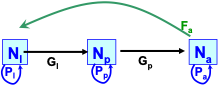

**A note before we begin:** This lab, along with other labs in this course, was written using R Markdown. R Markdown is a file format for making dynamic documents with R. An R Markdown document is written in markdown (an easy-to-write plain text format) and contains chunks of embedded R code. You can open and edit R Markdown files (.Rmd) in R Studio. To learn more about R Markdown, go [here](https://rmarkdown.rstudio.com/articles_intro.html). To learn about formatting in R Markdown, check [here](https://www.math.mcgill.ca/yyang/regression/RMarkdown/example.html), and [here](https://www.rstudio.com/wp-content/uploads/2015/02/rmarkdown-cheatsheet.pdf).  

## Background  
The Yellow mealworm beetle (Fig.1), Tenebrio molitor, has both negative and positive impacts on our economy. As a pest, it eats stored grain and cereal products; as a commodity, it is used by zoos and pet owners as food for reptiles. Thus, there is interest in measuring the growth rate of Yellow mealworm beetle populations, but also in determining efficient ways to either decrease or increase their population growth rates, depending on the application.  

Yellow mealworm beetles go through complete metamorphosis, and have four distinct life stages (egg, larva, pupa and adult; Fig. 1). These life stages differ in their vital rates (growth/development, fecundity, mortality), and these differences affect the overall population growth rate in complex ways. Ecologists routinely use stage-structured matrix population models to determine how changes in various stage-specific vital rates affect the growth rate of populations. This is a powerful way to evaluate different approaches for the management of either rare species or pest species.  

  
  
## Lab Goals  
In this lab you will measure the growth rate of Yellow mealworm beetle populations and you will evaluate the efficiency of different methods that could be used to manage (enhance or control) their population growth.  

To learn something about the population dynamics of these beetles, we first need data. In **Part I** of this lab, you will collect data on the stage-structure (i.e. the number of individuals in each life stage) of a Yellow mealworm beetle population. During **Part II**, you will learn how to use these data to calculate population growth rate and how to develop a population projection matrix model to evaluate different management strategies that could be used to control this population. Part II will take place in the computer labs.  
  
## Part 1: Data Collection  
*Note: Mealworm beetles cannot hurt you, but I suggest you wear gloves to manipulate them and that you wash your hands at the end of the lab.*  

We have been raising several populations of Yellow mealworm beetles for this lab. Students will work in groups of two to isolate, identify, measure and count the larvae, pupae and adult mealworm beetles. If you have a lot of beetles in the population you are assigned, you will need to subsample (your TA can help you determine whether you need to subsample). To subsample, mix the population very well and take a representative subsample of at least 200 individuals.  

Figure 1 should help you distinguish the three life stages. Larvae are long and segmented, and move quite actively (you may need to poke them gently to see them moving). People call them “mealworms”, but they are absolutely not worms! (see head and legs). These insect larvae eventually develop into pupae, which are entirely yellow and have a large head-like structure. Pupae are immobile, but during this stage the beetle undergoes complete metamorphosis. The adults are yellow when they first emerge, but quickly become darker. They are approximately 12-16 mm long and move around actively. The eggs are laid on and in the substrate. Eggs are small (~1mm), white and sticky, and due to their small size we will not be counting eggs in this lab.  

After you have identified and counted all larvae, pupae and adults in the container you were assigned, you will measure the size of all larvae (no need to do this for pupae and adults). Use calipers to measure total body length (i.e., tip of head to end of abdomen). Return all organisms to the container.  



### Data and Graphs to Hand-In 
**Data due by Friday 4 PM; graph due in lab next Thursday**  
Enter the count data for your group in Google Docs, including the identification of the container you used, by **Friday 4 PM** (Friday following the lab period in which the data were collected). Your TA will set up that Google Docs file and provide instructions on how to access the file (see Fig. 2 for example).  

Using your data, build a histogram to show the size distribution of the larvae in your population (i.e., all larvae in your container; one graph per student - no group work on this please). Separate your larvae into 3 equal size classes (from the smallest to the largest larva you measured). Each histogram should show number of individuals in each size class on the Y-axis, and the size class on the X-axis. No lab report for Part 1 of this lab.  

#### Graphing in R
In R, you can build a plot pretty easily!  

(1) Download your data as a .csv file from Google Docs (File -> Download -> Comma Separated Values (.csv)). Make sure to store your download in your working directory, so you can access it easily from the "Files" tab in R.  

(2) Read your data into R using **read.csv()**. For a refresher on how to use this function, check the "Introduction to R" document we worked through at the beginning of the course. **NOTE:** Write your code below my commented-out lines!  
``` {r, eval=FALSE}
name_of_data_set <- read.csv()
```

(3) Take a look at your data to make sure it imported correctly, using functions like those below. **NOTE:** You can remove #'s from multiple lines at a time by highlighting the lines you want to target, and using **cmd/ctrl+shift+c**.  
```{r, eval=FALSE}
summary(name_of_data_set)
head(name_of_data_set, n=10)
tail(name_of_data_set, n=10)
View(name_of_data_set)
```

(4) Now you're ready to plot! You've been asked to separate your larvae into 3 equal size classes, and plot a histogram showing the number of individuals in each size class on the Y-axis and the three size classes on the X-axis. In R, we can use the **hist()** function to make a histogram, and the "breaks" argument to automatically separate our data into classes. **Hint:** Remember to specify that you only want to plot the data from your "Larvae" column (name_of_data_set$column_name).  
```{r, eval=FALSE}
hist(name_of_data_set$column_name, breaks = number_of_size_classes)
```

  * You can add a plot title and axis labels using the **main**, **ylab**, and **xlab** arguments within your **hist()** function.  
```{r, eval=FALSE}
hist(name_of_data_set$column_name, breaks = number_of_size_classes, main = "plot title", ylab = "y-axis label", xlab = "x-axis label")
```

  * You can change the tick labels on your x-axis to reflect your size classes using the **xaxt** argument, set to **= "n"** to get rid of the default tick labels.  
```{r, eval=FALSE}
hist(name_of_data_set$column_name, breaks = number_of_size_classes, main = "plot title", ylab = "y-axis label", xlab = "x-axis label", xaxt = "n")
```

  * Then, add the **axis()** function. The first argument should be 1, to specify the axis position as "below". Then use the **at** argument to specify where you want your axis ticks to appear. Finally, use the **labels** argument to specify the tick labels.  
```{r, eval=FALSE}
hist(name_of_data_set$column_name, breaks = number_of_size_classes, xaxt = "n")
axis(1, at = c(x, y, z), labels = c("a", "b", "c"))
```

## Part 2: Analysis of the Mealworm Population Data  
The most direct way to measure population growth rates is to track the number of individuals through time. Unfortunately, this is rarely possible and we must usually rely on a single sample of the population to estimate its growth rate. The key to making such estimates is the realization that the age, size or life stage structure of a population contains information on survival, which in turn contains information on population growth rate, provided we make some assumptions about life history parameters of the species (e.g. fertility, development rate).  

In this lab we will use a Stage-Structured Population Projection Matrix to calculate the growth rate of your mealworm population and make demographic projections, and to develop management plans to enhance and/or reduce its growth. I have introduced this material in class (see Population Dynamics lecture), but here is your chance to really use these matrix models.    

### Stage Structured Population Projection Matrix  
Population Projection Matrix models are commonly used to make demographic predictions for a population of interest and to evaluate different management strategies that could be used to either control a pest species or to increase population numbers for a vulnerable or endangered species. The approach can be powerful, but we must remember that it is only as good as the data used to build the model (the garbage in – garbage out syndrome). As with any model, we must evaluate carefully the assumptions and uncertainties around each parameter when interpreting the predictions from the model.  

To make out Population Projection Matrices (PPMs), we'll be using an R package called [**"popbio"**](https://cran.r-project.org/web/packages/popbio/popbio.pdf), which can be used to construct and analyse projection matrix models. You can install and load "popbio" now.  
```{r, eval=FALSE}
install.packages("popbio")
library(popbio)
```

#### Model Description  
The stage-structured model we will apply to our mealworm population includes three life stages: larvae (l), pupae (p), adults (a). The model keeps track of females only, which is a common feature in demographic models. At each time step, three types of demographic processes operate on each female in the population: reproduction, mortality and development. Let’s first consider reproduction: each adult female produces a number of eggs that will be present during the next time step. None of the other stages produce eggs. Then comes mortality; all individuals have a stage-specific probability of dying. Those individuals who die are not present during the next time step. Each individual who escapes death has a certain stage-specific probability of developing and moving to the next stage. These processes iterate at each time step resulting in a dynamic stage structure and population size.  

The model can be represented in a graphical form (Fig. 3). Boxes indicate the number of individuals ($N_z$) in each life stage z (z = l for larvae, p for pupae, a for adults). Small circular arrows below the boxes indicate the probability of surviving and remaining in the same life stage at the beginning of the next time period ($P_z$). Straight arrows between boxes indicate the probability of surviving and entering the next life stage at the beginning of the next time period ($G_z$). The long curved arrow above the boxes indicates reproduction ($F_a$ is the number of female offspring born in one time interval per adult female).  

  

We can write the **stage-structured transition matrix (M)** for this model as:  

  

To calculate the number of individuals in each life stage in the future (vector $N_{(t+1)}$), we need to multiply the current number of individuals in each life stage (vector $N_t$) by the Stage-Structured Transition Matrix (M):  


This is equivalent to the following equations (review the rules of matrix multiplication and convince yourself that this is true):  
  
\begin{align}
    &\text{(1) Larvae (l): }&\ N_{l(t+1)} &=& P_l N_{l(t+1)} + F_a N_{a(t)}\\
    &\text{(2) Pupae (p): }&\ N_{p(t+1)} &=& G_l N_{l(t)} + P_p N_{p(t)}\\
    &\text{(3) Adults (a): }&\ N_{a(t+1)} &=& G_p N_{p(t)} + P_a N_{a(t)}\\
\end{align} 

This calculation can be repeated for as many time steps as needed to understand the projected population dynamics.  

#### Estimating Variables in the Stage-Structured Transition Matrix:  
We will model time discretely and we will use the shortest life stage (i.e. lowest common denominator, which is pupa; Table 1) to set the length of a time step to 20 days. When doing calculations it is usually more convenient to measure time in time step units and when interpreting the model it is clearer to express time in days. Remember that we may always convert back and forth between units of days and units of time steps.  

**To use the Stage-Structured Transition Matrix we need to estimate three vital rates for each life stage: Fz, Pz, Gz.** Some will be estimated with the data collected during the mealworm lab, others with published data for this species (Table 1).    

  

The easiest vital rate to estimate is **fecundity, F**, which is the number of female eggs produced by an adult female each time period (20 days). Only adult females can produce eggs (i.e., $F_l$ and $F_p$ = 0; note that they are not shown in Fig. 3). We have two pieces of information in Table 1 that will help us estimate $F_a$: typical time spent as an adult and typical number of eggs per surviving adult over its entire life. In order to make an estimate of $F_a$ using this information, we make three assumptions. First, we assume that that female reproduction is constant throughout its life (i.e. young adults lay the same number of eggs as old females). Second, we assume that the sex ratio is 1:1 for all stages (i.e. equal number of males and females). This means that 10 “female” eggs are laid per adult female in each of the 4 adult age classes (4 age classes since according to Table 1 adults live on average 80 days and our chosen time step is 20 days). Finally, we assume that all eggs will produce larvae and contribute to the number of larvae ($N_l$) in the next time step.  

**$G_z$ is the probability of surviving ($s_z$) and of growing into the next life stage ($g_z$) in the next time interval.** The probability of growing into the next life stage is calculated from the time step we decided to use (20 days) divided by the development time of each life stage (Table 1). For example, the adult stage lasts 80 days, so the probability of growing out of the adult stage (i.e. dying) is ga = 20/80 = 0.25. Remember, a probability value has to be between 0 and 1. The probability of surviving ($s_z$) is more complicated to estimate and we will need to make some assumptions to do so (see below). To calculate the probability that an individual with survive and will develop in the next life stage ($G_z$) you need to multiply $s_z$ and $g_z$:  

\begin{align}
    \text{(4) }\ G_z = s_z g_z\\
\end{align}  

**$P_z$ is the probability of surviving ($s_z$) and of remaining in the same life stage in the next time interval.** Note that once we know the probability of growing into the next life stage ($g_z$), we know the probability of remaining in the same life stage (1-$g_z$). To calculate the probability that an individual with survive and will remain in the same life stage ($P_z$) you need to multiply sz and (1-$g_z$):  

\begin{align}
    \text{(5) }\ P_z = s_z (1-g_z)\\
\end{align}  

Now, calculating the **probability of surviving ($s_z$)** is a bit more complicated because we are dealing with uneven life stages. To estimate the probability of surviving in each life stage ($s_z$), we first need to calculate the finite growth rate of this population (λ). If we assume that the finite growth rate is constant in all life stages (i.e. λ = $λ_l$ = $λ_p$ = $λ_a$), we can substitute equation 4 into equations 2 (note that $P_p$ = 0) to calculate λ:  

\begin{align}
    λ = λ_p = \frac{N_{p(t+1)}}{N_{p(t)}} = \frac{G_l N_{l(t)}}{ N_{p(t)}} = \frac{s_l g_l N_{l(t)}}{ N_{p(t)}}\\
\end{align}  

This equation can be simplified by replacing $N_z$ by the proportion of individuals surviving to a given life stage ($l_z$; same as $l_x$ in life tables. Note that $l_l$ = 1):  

\begin{align}
    \text{(6) }\ λ = \frac{s_l g_l}{l_p}\\
\end{align}  

The proportion of individuals surviving to a given life stage ($l_z$) is estimated from your data assuming that the population had reached a stable stage structure (fixed stage distribution reached by a population growing at a constant rate).  

Once we know the finite growth rate of the population (λ), we can estimate the probability of surviving through the larval stage ($s_l$) by rearranging equation 1 to isolate $λ_l$:  

\begin{align}
    λ_l = \frac{N_{l(t+1)}}{N_{l(t)}} = P_l + \frac{F_a l_a}{l_l} = s_l (1-g_l) + F_a l_a \text{...}\\
\end{align}  

... Rearranging equation (2) to isolate $λ_p$ (equation (6)), and setting $λ_l$ = $λ_p$:  

\begin{align}
    s_l (1-g_l) + F_a l_a &=& &\frac{s_l g_l}{l_p}&\\
    \text{(7) }\ s_l &=& &\frac{F_a l_a}{\frac{g_l}{l_p} + g_l - 1}&\\
\end{align}  

Finally, we can estimate the probability of surviving through the pupal stage ($s_p$) by rearranging equation (3) (note that $g_p$ = 1):  

\begin{align}
    λ = λ_a = \frac{N_{a(t+1)}}{N_{a(t)}} = \frac{G_p l_p + P_a l_a}{l_a} = \frac{s_p l_p}{l_a} + s_a (1-g_a)\\
\end{align}  

If we assume that $s_a$ = $s_p$, then:  

\begin{align}
    \text{(8) }\ s_s = \frac{λ}{\frac{l_p}{l_a} + (1-g_a)}\\ 
\end{align}  

Based on the numbered equations above, we can estimate and calculate all parameters we need to run the Stage-Structured Projection Matrix Model. First, you need to type out the names of your parameters, and assign them the values you estimated. Then, you can cosntruct your matrix using R's **matrix()** function. I've included an example in the code chunk below that you can use to write your matrix. 
```{r, eval=TRUE}
a <- 0.1; b <- 0.2; c <- 0; d <- 0; e <- 0.5; f <- 0.6; g <- 0.7; h <- 0; i <- 0.9
test_matrix <- matrix(c(a,b,c,d,e,f,g,h,i), nrow = 3, ncol = 3) # Where each letter is a term in the matrix; notice how R builds matrices, and use that observation to build yours...
test_matrix
```

Now, you try!  
```{r, eval=TRUE}
# Assign your estimated values to your parameters here:
# Pl <- __; Fa <- __; Gl <- __; etc.
# Write your matrix here:
# M <- matrix()
```

#### Population Projections  
We should now be ready to explore predictions from our model. This will allow us to:  
(1) Predict dynamics of the population we studied in the lab.  
(2) Evaluate different ways in which we could manage this population.  
(3) Test a fundamental rule in population ecology about stable stage structures.  

##### Dynamics of the Lab Population  
Let’s first explore the predictions for the mealworm beetle population you studied in the lab. Enter the initial stage structure you measured (i.e. number of individuals in each life stage; vector N in bottom part of the worksheet). Once you fill the M matrix with the estimated vital rates for your population, the stage structure of your population should be calculated automatically for future time steps (t+1, t+2, … t+72). Make graphs to help you visualize the population dynamics predicted by the model. Remember that these predictions are just as good as the data used to build the model. Think carefully about the assumptions you made and uncertainties (for example, the range of life history parameters in Table 1) as you interpret the predicted dynamics.  

We can do all this work in R using matrix multiplication! Let's say our initial abundaces/the population abundances at $t_0$, are all 1. Let's make a vector to represent that (P.S. Remember to remove the "#"!):  
```{r, eval=TRUE}
# abundance0 <- c()
```

Now, to get our population abundances for the next time step, $t_1$, we just need to multiply our PPM by that vector of initial abundances. The output of this operation will denote our population abundances at the next time step.  
```{r, eval=TRUE}
# abundance1 <- M %*% abundance0
# abundance1
```

We can do the same thing to find our population abundances for $t_2$, by using the $t_1$ abundances we just calculated.  
```{r, eval=TRUE}
# abundance2 <- M %*% abundance1
# abundance2
```

So, it would be a lot of work to write out this line 72 times... Luckily, we can write a **for loop** to perform this operation for us, for as many time steps as we'd like! Use the commented-out lines below to write your own for loop in this code chunk! **REMEMBER:** You can remove #'s from multiple lines at a time by highlighting the lines you want to target, and using **cmd/ctrl+shift+c**.  
```{r, eval=TRUE}
# nTimeSteps <-  # Number of time steps we'd like to consider
# M # Our PPM
# abundance0 <- c() # Initial population abundances
# 
# # Build an object to store your outputs in:
# AllAbundances <- matrix(0, nrow = nrow(M), ncol = nTimeSteps+1)
# # Set the initial population abundances
# AllAbundances[ ,1] <- abundance0
# # Write your for loop:
# for(t in 2:(nTimeSteps+1)){ # Set the loop to run through each time step; start at 2 because you've already set your initial abundances
#   AllAbundances[ ,t] <- M %*% AllAbundances[ ,t-1] # Reads: The population abundances at time t are given by multiplying our PPM by the population abundances at the previous time step, t-1. 
# }
```

We can plot the trajectory of our population over time using the **plot()** function.    
```{r, eval=TRUE}
# plot(1,1,pch="",ylim=c(0,max(AllAbundances)),xlim=c(0,nTimeSteps+1),xlab="Years",ylab="Abundance") # Set up plot
# cols <- c("darkgoldenrod2", "palegreen4", "palevioletred") # Colours! Google "r colours" to find some options!
# for(s in 1:ncol(M)){
#   points(AllAbundances[s,],col=cols[s],type="l",lwd=2) # Use another for loop to plot population abundances by time step
# }
# legend("topleft",col=cols,lwd=rep(2,ncol(M)),legend=paste("Stage ",seq(1:ncol(M)))) # Add a legend
```

Calculate the Finite per capita Population Growth Rate (λ) at each time step. What happens to $λ_t$ in the long run? This rate is the total number of individuals in the population (all stages included) one time step in the future ($N_{(t+1)}$) divided by the total number of individuals at the current time ($N_{(t)}$):  

\begin{align}
    λ_t = \frac{N_{(t+1)}}{N_{(t)}}\\
\end{align}  

We can find the dominant eigenvalue (λ) using a function from the popbio package, **eigen.analysis()**.  
```{r, eval=TRUE}
# dom_eigen <- eigen.analysis(M, zero = FALSE)
```

Calculate the Instantaneous per capita Population Growth Rate, *r*, at each time step (mention which units you are using). Make sure you understand the meaning of *r* and how it relates to λ.  

The R package [**"popdemo"**](https://cran.r-project.org/web/packages/popdemo/popdemo.pdf) can also help you out with a lot of these calculations. Install and load popdemo, and explore its **eigs()** function, which can give the dominant eigenvalue (asymptotic population growth), the dominant right eigenvector (stage stage distribution), and the dominant left eigenvector (reproductive value) of a PPM.  
```{r, eval=TRUE}
# Install

# Load

# Explore eig() function

# Use eig() to find the Instantaneous per capita Population Growth Rate

```

##### Dynamics of a Managed Population  
We will use our model to explore the possible consequences of manipulating our mealworm population in such a way that the vital rates change. For example, we may find evidence that our mealworm population is declining (λ < 1) but we want an increasing population because we have a business selling mealworms to pet stores for reptile food.  In this situation, we may want to introduce a hormone that is expected to increase the fecundity by a factor of two. We can use our model to explore any possible changes to the growth rate under doubled fecundity. Devise four management plans and explore their implications on the dynamics of the mealworm population.  

Keep in mind that there are several restrictions on the vital rates in order for them to be biologically meaningful.  The P's and G's must be between zero and one because they are proportions. The sum P and G for any stage must not exceed one because this sum is the proportion of surviving females that either remain in the current stage or move to the next stage; put more simply, this sum is the proportion of surviving females. $F_z$ must be non-negative because it is the average number of female eggs produced by adult females per time step.  
```{r, eval=TRUE}
# YOUR WORK HERE
```

##### Stable Stage Structure  
Alfred Lotka in the 1920s showed that a population with a constant schedule of fertility and mortality rates will reach a stable age (or stage) structure regardless of the initial age (or stage) structure of the population. This is a very important concept in population ecology. Does it apply to your mealworm population? At each time step, calculate the proportion of individuals in each life stage (**HINT:** Try writing your own for loop to perform this operation!).  In the long run, demonstrate that any set of constant vital rates leads to a *Stable Stage Structure*, meaning that the proportions of individuals in each stage remain constant over time.  

**NOTE:** You can find the stable stage distribution for your population by using the **stable.stage()** function from the popbio package. Run **?stable.stage** in the console to learn how to use the function!
```{r, eval=TRUE}
# YOUR WORK HERE
```

## Doing the Lab  
**Step 1:**  
Estimate parameters for your data.  

**Step 2:**  
Before doing parts C and D of the lab, assess whether the model is reasonable for your data. If the model produces impossible results, there are three possible explanations:  

* We made an error setting up your script.  
* You made an error when collecting your data or writing your code.  
* One or more model assumptions were violated.  

If you decide the model is unreasonable for your data, proceed to Step 3. Otherwise, finish the lab using your original data. You should only switch data set if you know that the model is unreasonable for your data.  

Regardless of whether or not you decide to switch data, you must explain your reasoning in your lab report. In particular:  

* In your Results, explain briefly how you know whether the model is reasonable (or not) for your data.  
* In your Results, explain what you can conclude from your plot.  
* In your Discussion, discuss possible ecological explanations for these results.  

**Step 3:**  
If you decide the model is unreasonable for your data, you may analyze these data instead:  

* Larvae: 11,563  
* Pupae: 221  
* Adults: 625  

## Lab Report  
#### Due on Quercus on --/--/--; 100 Pts  
Each student will hand in a formal lab report with the following sections:  

**Title Page**

* With informative title (be specific), your name, student number, EEB319 - Population Ecology, date submitted.  

**Introduction (1 pg. max.)**  

* Describe the species you are working with and why there would be interest in the results of this study (5 marks).  
* Succinctly state the questions you are asking (are you trying to enhance or control this population? why?) and justify the approach taken (5 marks).  

**Methods (1 pg. max.)**  

* Briefly describe your laboratory and analytical methods (5 marks).  
* Describe ***four*** management actions that could be taken to change the population growth rate (be creative!) and the vital rates that you will manipulate in your model to simulate these actions (5 marks).  

**Results (1 pg. max., not including figures and tables)**  

* Calculate the long-term Finite per capita Growth Rate (λ) and the Instantaneous per capita Growth Rate (r) for your lab population. What does this mean in terms of population dynamics (i.e., is the population stable, increasing or decreasing)? How long would it take this population of beetles to double in size? (5 marks).  
* Estimate all parameters in the Stage-based Transition Matrix (M) for your lab population (5 marks).  
* Explain briefly how you know whether the model is reasonable (or not) for your data (10 marks).  
* Explain what you can conclude from your plot (5 marks).  
* Graphs describing the simulated effect of 4 different management actions (10 marks).  
* Evidence that any population exposed to a constant schedule of fertility and mortality rates reaches a stable stage structure (5 marks).  

**Discussion (2 pgs. max.)**  

* Discuss possible ecological reasons for your results (5 marks).  
* Discuss the implications of your study for mealworm pest managers and/or suppliers of mealworms (10 marks).  
* Discuss the strengths and weaknesses of your study. What assumptions are you making? How realistic are these assumptions? (10 marks).  
* Describe future studies that could be used to test some of the assumptions made and/or conclusions reached by your study (5 marks).  

**NOTE:** There will also be 10 marks allocated to the structure and clarity of the text.  

## References  
* Canadian Grain Commission.  http://www.grainscanada.gc.ca  
* Dick, J. 1937. Oviposition in certain coleoptera. Annals of Applied Biology 4: 762-796.  
* Greenberg, S. & A. Ar 1996. Effects of chronic hypoxia, normoxia and hyperoxia on larval development in the beetle *Tenebrio molitor*. Journal of Insect Physiology 42: 991-996.  
* Hill, D.S. 2002. Pests of stored foodstuffs and their control. Kluwer Academic Publishers, Dordrecht.  
