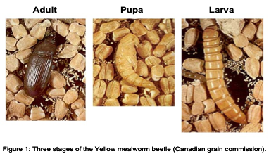
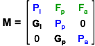
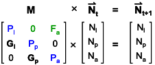
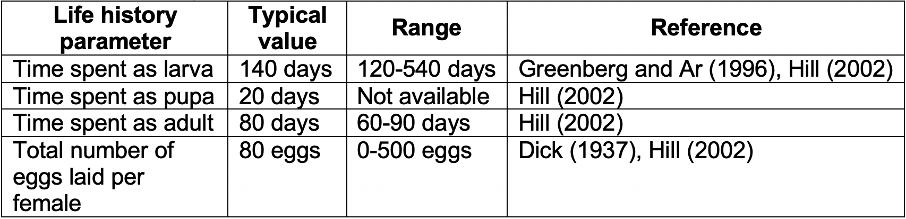

## Background  
The Yellow mealworm beetle (Fig. 1), *Tenebrio molitor*, has both negative and positive impacts on our economy. As a pest, it eats stored grain and cereal products; as a commodity, it is used by zoos and pet owners as food for reptiles. Thus, there is interest in measuring the growth rate of Yellow mealworm beetle populations, but also in determining efficient ways to either decrease or increase their population growth rates, depending on the application.  

Yellow mealworm beetles go through complete metamorphosis, and have four distinct life stages (egg, larva, pupa and adult; Fig. 1). These life stages differ in their vital rates (growth/development, fecundity, mortality), and these differences affect the overall population growth rate in complex ways. Ecologists routinely use stage-structured matrix population models to determine how changes in various stage-specific vital rates affect the growth rate of populations. This is a powerful way to evaluate different approaches for the management of either rare species or pest species.  

  
  
## Lab Goals  
1) Estimate the growth rate of a Yellow mealworm beetle population 

2) Evaluate the efficiency of different methods that could be used to manage (enhance or control) the population growth of these beetles.  

## Analysis of the mealworm population data
The most direct way to measure population growth rate is to track the number of individuals through time. Unfortunately, this is rarely possible and we must usually rely on a single sample of the population to estimate its growth rate. The key to making such estimates is the realization that the age, size or life stage structure of a population contains information on survival, which in turn contains information on population growth rate, provided we make some assumptions about life history parameters of the species (e.g. fertility, development rate).  

This year we don't have access to our lab cultures so we will use data collected by former students. We typically have different cultures and groups of students count the number of insects in each life stage. This year let's use data from a single culture: # larvae = 11563, # pupae = 221, # adults = 625. Use these data to build a vector with the abundance of each life stage at time *t* ($N_t$):
```{r, eval=TRUE}
# N_t <- c(11563,221,625)
# N_t    # check what your vector looks like
```


### Stage Structured Population Projection Matrix  
Population Projection Matrix models are commonly used to make demographic predictions for a population of interest and to evaluate different management strategies that could be used to either control a pest species or to increase population numbers for a vulnerable or endangered species. The approach can be powerful, but we must remember that it is only as good as the data used to build the model (the garbage in – garbage out syndrome). As with any model, we must evaluate carefully the assumptions and uncertainties around each parameter when interpreting the predictions from the model. I have introduced this material in class (see Population Dynamics lecture), but here is your chance to really use these matrix models.     

To make out Population Projection Matrices (PPMs), we'll be using an R package called [**"popbio"**](https://cran.r-project.org/web/packages/popbio/popbio.pdf), which can be used to construct and analyse projection matrix models. You can install and load "popbio" now.  
```{r, eval=FALSE}
install.packages("popbio")
library(popbio)
```

#### A. Model Description  
The stage-structured model we will apply to our mealworm population includes three life stages: larvae (l), pupae (p), adults (a). The model keeps track of females only, which is a common feature in demographic models. At each time step, three types of demographic processes operate on each female in the population: reproduction, mortality and development. Let’s first consider reproduction: each adult female produces a number of eggs that will be present during the next time step. None of the other stages produce eggs. Then comes mortality; all individuals have a stage-specific probability of dying. Those individuals who die are not present during the next time step. Each individual who escapes death has a certain stage-specific probability of developing and moving to the next stage. These processes iterate at each time step resulting in a dynamic stage structure and population size.  

The model can be represented in a graphical form (Fig. 2). Boxes indicate the number of individuals ($N_z$) in each life stage z (z = l for larvae, p for pupae, a for adults). Small circular arrows below the boxes indicate the probability of surviving and remaining in the same life stage at the beginning of the next time period ($P_z$). Straight arrows between boxes indicate the probability of surviving and entering the next life stage at the beginning of the next time period ($G_z$). The long curved arrow above the boxes indicates reproduction ($F_a$ is the number of female offspring born in one time interval per adult female).  

  

We can write the **stage-structured transition matrix (M)** for this model as:  

  

To calculate the number of individuals in each life stage in the future (vector $N_{(t+1)}$), we need to multiply the current number of individuals in each life stage (vector $N_t$) by the Stage-Structured Transition Matrix (M):  



This is equivalent to the following equations (review the rules of matrix multiplication and convince yourself that this is true):  
  
\begin{align}
    &\text{(1) Larvae (l): }&\ N_{l(t+1)} &=& P_l N_{l(t)} + F_a N_{a(t)}\\
    &\text{(2) Pupae (p): }&\ N_{p(t+1)} &=& G_l N_{l(t)} + P_p N_{p(t)}\\
    &\text{(3) Adults (a): }&\ N_{a(t+1)} &=& G_p N_{p(t)} + P_a N_{a(t)}\\
\end{align} 

This calculation can be repeated for as many time steps as needed to understand the projected population dynamics.  

#### B. Estimating Variables in the Stage-Structured Transition Matrix:  
We will model time discretely and we will use the shortest life stage (i.e. lowest common denominator, which is pupa; Table 1) to set the length of a time step to 20 days. When doing calculations it is usually more convenient to measure time in time step units and when interpreting the model it is clearer to express time in days. Remember that we may always convert back and forth between units of days and units of time steps.  

To use the Stage-Structured Transition Matrix we need to estimate three vital rates for each life stage: $F_z$, $P_z$, $G_z$. Some will be estimated with our lab data, others with published data for this species (Table 1).    

  

**References for Table 1 Data:**  

* Canadian Grain Commission. http://www.grainscanada.gc.ca.    
* Dick, J. 1937. Oviposition in certain coleoptera. Annals of Applied Biology 4: 762-796.  
* Greenberg, S. & A. Ar 1996. Effects of chronic hypoxia, normoxia and hyperoxia on larval development in the beetle Tenebrio molitor. Journal of Insect Physiology 42: 991-996.  
* Hill, D.S. 2002. Pests of stored foodstuffs and their control. Kluwer Academic Publishers, Dordrecht.  

The easiest vital rate to estimate is **fecundity, F**, which is the number of female eggs produced by an adult female each time period (20 days). Only adult females can produce eggs (i.e., $F_l$ and $F_p$ = 0; note that they are not shown in Fig. 2). We have two pieces of information in Table 1 that will help us estimate $F_a$: typical time spent as an adult and typical number of eggs per surviving adult over its entire life. In order to make an estimate of $F_a$ using this information, we make three assumptions. First, we assume that that female reproduction is constant throughout its life (i.e. young adults lay the same number of eggs as old females). Second, we assume that the sex ratio is 1:1 for all stages (i.e. equal number of males and females). This means that 10 “female” eggs are laid per adult female in each of the 4 adult age classes (4 age classes since according to Table 1 adults live on average 80 days and our chosen time step is 20 days). Finally, we assume that all eggs will produce larvae and contribute to the number of larvae ($N_l$) in the next time step.  

Let's set the values for fecundity (*F*):
```{r, eval=TRUE}
# Assign values for each life stage:
# Fl <- 0  # fecundity of larvae is zero
# Fp <- 
# Fa <- 
```

**$G_z$ is the probability of surviving ($s_z$) and of growing into the next life stage ($g_z$) in the next time interval.** The probability of growing into the next life stage is calculated from the time step we decided to use (20 days) divided by the development time of each life stage (Table 1). For example, the adult stage lasts 80 days, so the probability of growing out of the adult stage (i.e. dying) is $g_a$ = 20/80 = 0.25. Remember, a probability value has to be between 0 and 1. 

Let's set the values for the probability of growing into the next life stage (*g*)
```{r, eval=TRUE}
# Assign values for each life stage:
# gl <-  
# gp <- 
# ga <- 0.25  # probability of adults growing out of their lifestage (i.e. dying) is 0.25
```

The probability of surviving ($s_z$) is more complicated to estimate and we will need to make some assumptions to do so (see below). To calculate the probability that an individual with survive and will develop in the next life stage ($G_z$) you need to multiply $s_z$ and $g_z$: 
\begin{align}
    \text{(4) }\ G_z = s_z g_z\\
\end{align}  

**$P_z$ is the probability of surviving ($s_z$) and of remaining in the same life stage in the next time interval.** Note that once we know the probability of growing into the next life stage ($g_z$), we know the probability of remaining in the same life stage (1-$g_z$). To calculate the probability that an individual with survive and will remain in the same life stage ($P_z$) you need to multiply $s_z$ and (1-$g_z$):  

\begin{align}
    \text{(5) }\ P_z = s_z (1-g_z)\\
\end{align}  

Now, calculating the **probability of surviving ($s_z$)** is a bit more complicated because we are dealing with uneven life stages. To estimate the probability of surviving in each life stage ($s_z$), we first need to calculate the finite growth rate of this population (λ). If we assume that the finite growth rate is constant in all life stages (i.e. λ = $λ_l$ = $λ_p$ = $λ_a$), we can substitute equation 4 into equations 2 (note that $P_p$ = 0) to calculate λ:

\begin{align}
    λ = λ_p = \frac{N_{p(t+1)}}{N_{p(t)}} = \frac{G_l N_{l(t)}}{ N_{p(t)}} = \frac{s_l g_l N_{l(t)}}{ N_{p(t)}}\\
\end{align}  

This equation can be simplified by replacing $N_z$ by the proportion of individuals surviving to a given life stage ($l_z$; same as $l_x$ in life tables. Note that $l_l$ = 1):  

\begin{align}
    \text{(6) }\ λ = \frac{s_l g_l}{l_p}\\
\end{align}  

The proportion of individuals surviving to a given life stage ($l_z$) is estimated from your data assuming that the population had reached a **stable stage structure** (fixed stage distribution reached by a population growing at a constant rate).  

```{r, eval=TRUE}
# ll <- 1  # by definition for the first life stage
# Calculate lp for pupae and la for adults
# lp <- N_t[2] / N_t[1]  # In our data vector N_t, larvae are listed 1st, pupae 2nd
# la <-
```

Since we assume the finite growth rate is constant in all life stages (λ), we can estimate the probability of surviving through the larval stage ($s_l$) by rearranging equation 1 to isolate $λ_l$:  

\begin{align}
    λ_l = \frac{N_{l(t+1)}}{N_{l(t)}} = P_l + \frac{F_a l_a}{l_l} = s_l (1-g_l) + F_a l_a \text{...}\\
\end{align}  

..., rearranging equation (2) to isolate $λ_p$ (equation (6)), and setting $λ_l$ = $λ_p$:  

\begin{align}
    s_l (1-g_l) + F_a l_a &=& &\frac{s_l g_l}{l_p}&\\
    \text{(7) }\ s_l &=& &\frac{F_a l_a}{\frac{g_l}{l_p} + g_l - 1}&\\
\end{align}  


Finally, we can estimate the probability of surviving through the pupal stage ($s_p$) by rearranging equation (3) (note that $g_p$ = 1):  

\begin{align}
    λ = λ_a = \frac{N_{a(t+1)}}{N_{a(t)}} = \frac{G_p l_p + P_a l_a}{l_a} = \frac{s_p l_p}{l_a} + s_a (1-g_a)\\
\end{align}  

If we assume that $s_a$ = $s_p$, then:  

\begin{align}
    \text{(8) }\ s_p = \frac{λ}{\frac{l_p}{l_a} + (1-g_a)}\\ 
\end{align}  

```{r, eval=TRUE}
# Calculate the probability that larvae survive using equation 7:
# sl <- (Fa*la)/((gl/lp)+gl-1) # Note: watch out for upper/lowercase variable names (as set above)
# This allows you to calculate lambda using equation 6:
# lambda <- 
# and to calculate sp using equation 8 (Remember: we assume lambda is the same for all life stages):
# sp <- 
# sa <- sp  # assumption used to derive equation 8

# Now you can calculate G (equation 4) and P (equation 5) for each life stage:
# Gl <- 
# Gp <- 
# Ga <-
# Pl <-
# Pp <-   # check that Pp = 0 (as mentioned above)
# Pa <-
```

You have now calculated all parameters we need to run the Stage-Structured Projection Matrix Model. Let's construct your stage-based transition matrix (**M**) using R's **matrix()** function. I've included an example in the code chunk below to build a 3x3 matrix. Notice how R builds matrices:
```{r, eval=TRUE}
a <- 0.1; b <- 0.2; c <- 0; d <- 0; e <- 0.5; f <- 0.6; g <- 0.7; h <- 0; i <- 0.9
test_matrix <- matrix(c(a,b,c,d,e,f,g,h,i), nrow = 3, ncol = 3) # Where each letter is a term in the stage-based transition matrix (M). Note in which order they come out in the matrix. 
test_matrix
```

Now, you try to write your stage-based transition matrix (**M**)!  
```{r, eval=TRUE}
# M <-
```

#### C. Population Projections  
We should now be ready to explore predictions from our model. This will allow us to:  
(1) Predict the dynamics of the lab population.  
(2) Evaluate different ways in which we could manage this population.  
(3) Test a fundamental rule in population ecology about stable stage structures.  

##### C1. Dynamics of a Lab Population  
Let’s first explore the predictions for our mealworm beetle population. You have a matrix **M** with the estimated vital rates for this species and a vector **$N_t$** with the observed stage structure of the lab population. You now need to multiply repeatedly the stage-based transition matrix to the stage structure of your population at different times in the future (time steps t+1, t+2, … t+72). 

We can do all this work in R using matrix multiplication! You already prepared a vector with the number of larvae, pupae and adults counted in our lab population ($N_t$). Now, to get our population abundances for the next time step, $t_1$, we just need to multiply our transition matrix **M** by that vector of initial abundances. The output of this operation will denote our population abundances at the next time step.  
```{r, eval=TRUE}
# N_t1 <- M %*% N_t
# N_t1
```

We can do the same thing to find our population abundances for $t_2$, by using the $t_1$ abundances we just calculated.  
```{r, eval=TRUE}
# N_t2 <- M %*% N_t1
# N_t2
```

So, it would be a lot of work to write out this line 72 times... Luckily, we can write a **for loop** to perform this operation for us, for as many time steps as we'd like! Use the commented-out lines below to write your own for loop in this code chunk! **REMEMBER:** You did this in Lab 1. **Note:** you can remove #'s from multiple lines at a time by highlighting the lines you want to target, and using **cmd/ctrl+shift+c**.  
```{r, eval=TRUE}
# nTimeSteps <-  # Number of time steps we'd like to consider
# M # Our transition matrix
# N_t # Initial (observed) abundances
# 
# # Build a matrix to store your outputs:
# N_projected <- matrix(0, nrow = nrow(M), ncol = nTimeSteps+1)  # each column is one timestep
# # Include the initial abundances in the first column of your output matrix
# N_projected[ ,1] <- N_t
# # Write your for loop:
# for(t in 2:(nTimeSteps+1)){ # Set the loop to run through each time step; start at 2 because you've already set your initial abundances
#   N_projected[ ,t] <- M %*% N_projected[ ,t-1] # Reads: The population abundance at time t is calculated by multiplying our M matrix by the population abundance at the previous time step, t-1. 
# }
```

We can plot the trajectory of our population over time using the **plot()** function. Remember that these predictions are just as good as the data used to build the model. Think carefully about the assumptions you made and uncertainties (for example, the range of life history parameters in Table 1) as you interpret the predicted dynamics.  
```{r, eval=TRUE}
# plot(1,1,pch="",ylim=c(0,max(N_projected)),xlim=c(0,nTimeSteps+1),xlab="Time periods (20 days)",ylab="Abundance") # Set up plot
# cols <- c("darkgoldenrod2", "palegreen4", "palevioletred") # Colours! Google "r colours" to find some options!
# for(s in 1:ncol(M)){
#   points(N_projected[s,],col=cols[s],type="l",lwd=2) # Use another for loop to plot population abundances by time step
# }
# legend("topleft",col=cols,lwd=rep(2,ncol(M)),legend=paste("Stage ",seq(1:ncol(M)))) # Add a legend
```

The Finite *per capita* Population Growth Rate (λ) you estimated from your data tells you the growth of your population over a given period of time (t). This allows you to calculate the Instantaneous *per capita* Population Growth Rate, *r* since:

\begin{align}
    \text{(9) } λ = \frac{N_{a(t+1)}}{N_{a(t)}} = e^{r⋅t}\\
\end{align}  
 
 So, 
 
\begin{align} 
    r = \frac{ln(λ)}{t}\\
\end{align}  

Calculate the *Instantaneous r* for our population (what are the units for *r*?):
```{r, eval=TRUE}
# t <- ....   # what time period did we use?
# r <- log(lambda) / t  # Note: log for base e (=ln), log10 for base 10
# r
```

Once we know *r*, we can calculate the doubling time of a population, which is a more intuitive way to understand how quickly our population is growing. To do this, we rearrange equation 9 above for *r*:

\begin{align} 
    r = \frac{ln(\frac{N_{a(t+1)}}{N_{a(t)}})}{t}\\
\end{align}  

then include a doubling of the population and solve for *t*:

\begin{align} 
    t_2x = \frac{ln(2)}{r}\\
\end{align}  

Calculate how quickly our population doubles in size and how how long it will take to increase 5 times. **Express your answer in days**:
```{r, eval=TRUE}
# t_2x <- log(2) / r  
# t_5x <- .....
```

##### C2. Dynamics of a Managed Population  
We will now use our model to explore the possible consequences of manipulating our mealworm population in such a way that the vital rates change. For example, we may find evidence that our mealworm population is declining (λ < 1) but we want an increasing population because we have a business selling mealworms to pet stores for reptile food. In this situation, we may want to introduce a hormone that is expected to increase the fecundity by a factor of two. We can use our model to explore any possible changes to the growth rate under doubled fecundity. Devise **TWO management plans** and explore their implications on the dynamics of the mealworm population.  

Keep in mind that there are several restrictions on the vital rates in order for them to be biologically meaningful. The P's and G's must be between zero and one because they are proportions. The sum P and G for any stage must not exceed one because this sum is the proportion of surviving females that either remain in the current stage or move to the next stage; put more simply, this sum is the proportion of surviving females. $F_z$ must be non-negative because it is the average number of female eggs produced by adult females per time step.  

```{r, eval=TRUE}
# YOUR WORK HERE
```

##### C3. Stable Stage Structure  
Alfred Lotka in the 1920s showed that a population with a constant schedule of fertility and mortality rates will reach a stable age (or stage) structure regardless of the initial age (or stage) structure of the population. This is a very important concept in population ecology. Does it apply to our mealworm population? At each time step, calculate the proportion of individuals in each life stage (**HINT:** Try writing your own for loop to perform this operation!). 

```{r, eval=TRUE}
# YOUR WORK HERE
```

Repeat this exercise for your two managed populations to convince yourself that any set of constant vital rates leads to a *Stable Stage Structure*, meaning that the proportions of individuals in each stage remain constant over time.  

```{r, eval=TRUE}
# YOUR WORK HERE
```


## Lab 3 Individual assignment and Marking:  
Submit your assignment as an R Markdown file on Quercus.  

### B) Transition Matrix (M) for our lab population: 10%
Print Stage-based Transition Matrix (M) for our lab population. 

### C1) Dynamics of our lab population: 25% 
a) List the Finite and Instantaneous *per capita* growth rates for our lab population, **with units**. What do those values mean about the dynamics of our population? (do they tell us the population is increasing, decreasing or stable)? 

b) Show your graph.(hopefully it matches your answer in (a); if not why not?) 

c) Discuss possible ecological reasons for this dynamics in our beetle culture.

d) How long would it take this population of beetles to double in size? to increase 5X in size? (include units)  

### C2) Dynamics of managed populations: 40%
a) Describe how you want to manage your population (and why).  

b) Describe two management plans. Mention how would you modify these parameters in practice.

c) Results: 2 graphs with brief description of result from each graphs.

d) Conclusion (in terms of your management plan).

### C3) Stable Stage Structure: 15% 
a) Show 3 graphs (lab population plus 2 managed populations).

b) Describe briefly the results from these graphs. Are the results similar/different?

c) Conclusion: over the long run, do populations with constant vital rates reach a stable stage structure? 
    
### Code: 10%
Code with clear and concise comments. Code runs.

