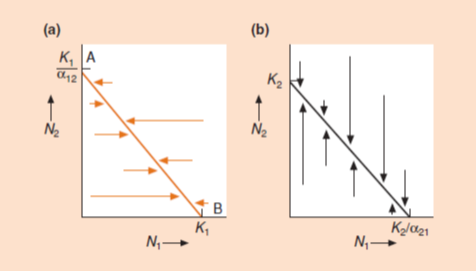
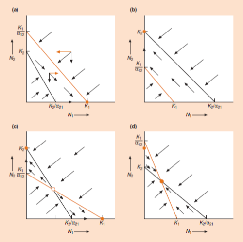

For this lab, you'll need to install the following two packages: **"deSolve"** and **"phaseR"**. You can do that here:
```{r}
# Install deSolve and phaseR here:

```

### Background  
In the 1930s, the Russian ecologist G.F. Gause performed a set of very influential experiments to test the competition models developed a few years earlier by Vito Volterra (Gause 1932, 1934). These models, now called the Lotka-Volterra competition models, are based on logistic population growth equations. As we have seen in lecture, these logistic growth equations describe how the density of a species ($N_1$) changes through time when it is grown alone:  

\begin{align}
    \text{(1) }\ \frac{dN_1}{dt} = r_1 N_1 \frac{K_1 - N_1}{K_1}\\
\end{align}  

The presence of a competing species will reduce the carrying capacity of species 1 ($K_1$) in this particular environment. To describe this, equation (1) can be modified to include the reduction in $K_1$ induced by species 2:  

\begin{align}
    \text{(2) }\ \frac{dN_1}{dt} = r_1 N_1 \frac{(K_1 - α_{12}N_2) - N_1}{K_1}\\
\end{align}

Where $α_{12}$ is the competition coefficient that measures the *per capita* competitive effect on species 1 of species 2 (by convention, the subscripts are listed in this order), $N_2$ is the density of species 2 and, therefore, $α_{12}$ $N_2$ is the number of individuals of species 1 to which species 2 is ecologically equivalent.  

In the same way, the effect of species 1 on the growth of a population of species 2 can be modeled as:  

\begin{align}
    \text{(3) }\ \frac{dN_2}{dt} = r_2 N_2 \frac{(K_2 - α_{21}N_1) - N_2}{K_2}\\
\end{align}  

Equations (2) and (3) can be used to predict the outcome of interspecific competition between species 1 and 2. The easiest way to visualize the outcome of interspecific competition between 2 species is to use a phase plane diagram, where $N_1$ is found along the X-axis and $N_2$ is on the Y-axis (see Fig. 1; we will cover this in detail in class). This special type of graph shows all possible combinations of population densities for the 2 species we are interested in, and is commonly used to follow the population dynamics of 2 interacting species. For e.g., simultaneous changes in $N_1$ and $N_2$ through an experiment would be represented by a line starting at the point of initial densities (i.e., $N_1$ and $N_2$ at the beginning of the experiment) and going through all combinations of $N_1$ and $N_2$ observed during the experiment to the final point representing $N_1$ and $N_2$ at the end of the experiment. To visualize the outcome of interspecific competition, we plot the zero population growth isoclines predicted by the Lotka-Volterra competition models for each species (i.e. the line where population growth rate is zero, or $\frac{dN}{dt} = 0$) onto a phase plane diagram.  For species 1, the zero population growth isocline is obtained by setting $\frac{dN_1}{dt}$ to zero in equation (2),  

\begin{align}
    \text{(4) }\ 0 = r_1 N_1 \frac{(K_1 - α_{12}N_2) - N_1}{K_1}\\
\end{align}  

which can be simplified and rearranged to:  

\begin{align}
    \text{(5) }\ N_1 = K_1 - α_{12}N_2\\
\end{align}  

This isocline is a straight line that intersects the Y-axis (i.e., when $N_1=0$) at $\frac{K_1}{α_{12}}$ (you obtain this by solving equation (5) for $N_2$), and that intersects the X-axis (i.e., when $N_2=0$) at $K_1$ (Fig. 1, left panel). When the density of species 1 ($N_1$) is higher than this isocline (i.e., to the right of the isocline), species 1 is under severe competition and its abundance decreases towards the isocline; when $N_1$ is lower than the isocline (i.e., to its left), competition is weak and $N_1$ will increase towards the isocline. The changes in $N_1$ towards the isocline are shown by horizontal arrows.  

  

In the same way, the zero growth isocline for the population of species 2 can be drawn as a straight line that intersects the X-axis at $\frac{K_2}{α_{21}}$ and that intersects the Y-axis at $K_2$. When $N_2$ is higher than this isocline (i.e., above the isocline), it decreases towards it; when $N_2$ is lower than the isocline (i.e., below), it increases towards it (right panel of Fig. 1). The changes in $N_2$ towards the isocline are shown by vertical arrows. 

There are four possible ways in which the zero population growth isoclines of species 1 and 2 can be positioned relative to each other (Fig. 2), and their relative positions determine the outcome of interspecific competition. When the isoclines do not cross each other, the species with the highest isocline competitively excludes the species with the lowest isocline (Fig. 2a, b). When the isoclines cross each other, they may show an unstable equilibrium where either species could go extinct (Fig. 2c) or a stable equilibrium where both species coexist (Fig. 2d).  

  


According to these models, if we know the population parameters of each species (*r* and *K*) and if we have a measure of the strength of the interaction between the species ($α_{12}$, $α_{21}$) we should be able to predict the outcome of competition. Will these two species coexist or not?  

**References**:
*Gause, G.F. 1932. Experimental studies on the struggle for existence. I. Mixed population of two species of yeast.  J. Exp. Biol. 9: 389-402; Gause, G.F. 1934. The struggle for existence. Macmillan, NY. (available on line at http://www.ggause.com/Contgau.htm)*


### Lab Goals
(1) Repeat the pioneering competition experiment of G.F. Gause.

(2) Estimate population parameters from the data and use the Lotka-Volterra competition model to calculate the expected outcome of competition. 


### Getting data
Usually we have students perform a competition experiment with protozoans in the lab, but this year we will use Gause's original data to run the analysis. 

**1) Select one of the following three data sets**:

* Gause, G.F. 1932. *Experimental studies on the struggle for existence. I. Mixed population of two species of yeast.* J. Exp. Biol. 9: 389-402. Table 1: use all data (from both experiments). Use "Volume of yeast" (biomass) as your measure of abundance. You will need abundance data from both monocultures and for each species in the mixed culture. Note: the "Volume" of each species grown in mixed culture is found in the last 2 column of Table 1.

* Gause, G.F., O.K. Nastukova and W.W. Alpatov. 1934. *The influence of biologically conditioned media on the growth of a mixed population of Paramecium caudatum and P. aurelia.* J. Anim. Ecol. 3(2): 222-230. Table 1: use data either from "medium of *P. caudatum*" **or** "medium of *P. aurelia*". 

**2) Prepare .csv files** with the chosen data set (as you did in Lab 1). Since Gause did not measure abundance exactly at the same time for all populations it will be easier to prepare four separate data files, one for each population (2 monocultures, 2 species in mixed culture). Include column titles (single word, no space) in the first row of your file: "time", "N" and name your files with something easy to recognize: "sp1_mono", "sp2_mono", "sp1_mixed", "sp2_mixed". 

Import your csv files into R:
```{r, eval=FALSE}
Data_sp1mono <- read.csv("sp1_mono.csv")   
Data_sp2mono <-
Data_sp1mixed <-
Data_sp2mixed <-
```

**3) Estimate population parameters.** Fit a logistic growth model to these four populations to estimate their intrinsic population growth rate (*r*) and carrying capacity (*K*). 

We will use **non-linear regression to fit logistic models** to Gause's data. This is done with the ***nls*** (non-linear least square) function. This function needs initial values for each parameter and then iterates these parameters until it finds the best fit for the data. We could just eyeball these initial parameter values, but R has a built-in function to estimate starting values for the parameter of a logistic equation (*SSlogis*) so let's use that.

```{r, eval=FALSE}
# select the population that needs fitting
Data <- Data_sp1mono
N_obs <- Data$N    
t <- Data$time
# find initial parameter values
SS<-getInitial(N_obs~SSlogis(times,alpha,xmid,scale),data=data.frame(N_obs=N_obs,times=t))
# convert the SSlogis estimated parameters to parameters we use in population ecology
K_start<-SS["alpha"]
r_start<-1/SS["scale"]
N0_start<-SS["alpha"]/(exp(SS["xmid"]/SS["scale"])+1)

# Now that you have initial values for each parameter, we will run the analysis
# first specify the formula (logistic population growth model)
logistic_formula<-formula(N_obs~(N0*K)/(N0+(K-N0)*exp(-r*t)))
# fit the model using non-linear regression
model<-nls(logistic_formula,start=list(K=K_start,r=r_start,N0=N0_start))
# plot to make sure the model is a good representation of the data
plot(Data$t, Data$N_obs)
lines(Data$t, predict(model))
# review the estimated parameters of the fitted model and goodness of fit
summary(model)
cor(N_obs,predict(model))

# REPEAT for other populations

# rename the population parameters we will need below
K1 <- summary(model)$coefficients[1,1]    # carrying capacity (in monoculture)
r1 <- summary(model)$coefficients[2,1]    # intrinsic growth rate (in monoculture)
K2 <-
r2 <- 
K1_mixed <-
r1_mixed <- 
K2_mixed <-
r2_mixed <- 
```

**4) Calculate the doubling time of both species** in monocultures, as you did in Lab 3. What are the units of these $t_{2x}$?
```{r, eval=FALSE}
t2x_sp1mono <-
t2x_sp2mono <-
```

**5) Plot the data with fitted logistic growth curves.** Prepare one graph for each species showing their abundance in monoculture and in mixed culture (Y-axis) over time (X-axis). This means two graphs, each with two sets of data and two logistic curves fitting these data. Add a graph legend and axis titles with units.  

*For general information on plotting in base R, check:  
* [R Base Graphs](http://www.sthda.com/english/wiki/r-base-graphs)  
* [R Base Graphics: An Idiot's Guide](https://rstudio-pubs-static.s3.amazonaws.com/7953_4e3efd5b9415444ca065b1167862c349.html) 
* [The Base Plotting System in R](https://rstudio-pubs-static.s3.amazonaws.com/84527_6b8334fd3d9348579681b24d156e7e9d.html)  
* [Base Plotting in R from Towards Data Science](https://towardsdatascience.com/base-plotting-in-r-eb365da06b22)  *


### Calculating competition coefficients 
A competition coefficient measures the effect of one species on the growth of another. These coefficients are measured by comparing the potential for growth of a species in monoculture (grown alone) to its realized growth, under exactly the same conditions (same food availability, temperature, etc), with a second species.  

If equilibrium is reached in the monocultures and in the mixed culture, the competition coefficients are calculated by rearranging equation (5) and its equivalent for species 2:  

\begin{align}
    \text{(6) }\ α_{12} = \frac{K_1 - N_1}{N_2}\\
\end{align}  

and,  

\begin{align}
    \text{(7) }\ α_{21} = \frac{K_2 - N_2}{N_1}\\
\end{align}  

where $K_1$ is the carrying capacity of species 1 in monoculture, $K_2$ is the carrying capacity of species 2 in monoculture, $N_1$ is population density of species 1 at equilibrium (i.e., its carrying capacity) when it is grown in a mixed culture with species 2, and $N_2$ population density of species 2 at equilibrium when it is grown in a mixed culture with species 1.  

Calculate this in R:
```{r, eval=FALSE}
a12 <- 
a21 <- 
```

Let's gather all model parameters in a vector:
```{r, eval=FALSE}
parameters <- c(r1,r2,K1,K2,a12,a21)  # order of parameters set for LVcomp function below
```

You can also present them in a table:  
```{r, echo=FALSE, results='asis'}
Species_r <- c("Sp. 1, r1", "Sp. 2, r1"); t2x <- c("t_2x", "t_2x"); K <- c("K1", "K1"); CompCoeff <- c("a21", "a12")
parms_table2 <- data.frame(Species_r, t2x, K, CompCoeff)
colnames(parms_table2) <- c("Species r (units)", "t<sub>2x</sub> (units)", "K (units)", "Competition Coefficient on Other Species (units)")
library(knitr)
kable(parms_table2, caption = "Parameters")
```

## Visualizing population dynamics with a Phase Plane Diagram
We now have everything needed to plot a Phase Plane diagram, which will allow us to visualize  population trajectories in this dynamical system. Here, our dynamical system is a set of Ordinary Differential Equations (ODE; for $\frac{dN_1}{dt}$ and $\frac{dN_2}{dt}$) that represent the abundances of two interacting species over time. In Phase Plane, net zero-growth isoclines (NZGI) indicate where $\frac{dN_1}{dt}$ and $\frac{dN_2}{dt} = 0$. Where two net zero-growth isoclines intersect, we have an equilibrium (stable or unstable). A flow field of arrows shows how the two populations change through time.

Here's an example of a phase plane diagram:  
```{r, eval=TRUE, echo = FALSE}
library(deSolve); library(phaseR)
LVcomp<-function(t, y, p){
  N1 <- y[1]; N2 <- y[2]
  r1 <- p[1]; r2 <- p[2]; K1 <- p[3]; K2 <- p[4]; a12 <- p[5]; a21 <- p[6]
  dN1 <- r1*N1*((K1-N1-a12*N2)/K1) 
  dN2 <- r2*N2*((K2-N2-a21*N1)/K2)
  return(list(c(dN1,dN2)))
}
#N1t0 <- 1; N2t0 <- 2     # choose a starting point (try several)
N1t0 <- 50; N2t0 <- 80
#N1t0 <- 10; N2t0 <- 60
inits <- c(N1t0,N2t0)
stepsize <- 0.1
TT <- seq(1, 500, stepsize)
# Here are fictive model parameters so you can see the output
r1 <- 1; r2 <- 1; K1 <- 50; a12 <- 0.5; a21 <- 0.3; K2 <- 25
parms <- c(r1,r2,K1,K2,a12,a21)
results <- lsoda(inits, TT, LVcomp, parms)
thin <- seq(from=1,to=dim(results)[[1]],by=(1/stepsize))
results1 <- results[thin,] 
results1 <- results1[is.na(results1[,2])==F,]
par(mfrow=c(1,1)); par(mar=c(5,5,4,3))
xmax=K2/a21; ymax=K1/a12
plot(results1[,3] ~ results1[,2], type = "l", xlim = c(0,xmax*1.1), ylim = c(0,ymax*1.1), ylab = "Species 2 (units)", xlab = "Species 1 (units)", cex.lab = 1.3, main = "Lotka-Volterra Competition Model, EXAMPLE", cex.main = 1.5, lwd = 2, frame.plot = FALSE, axes = FALSE)
axis(1, col = "white")
axis(2, col = "white")
abline(h = 0, v = 0, lty = 1, col = "black")
flowfield <- flowField(LVcomp, xlim = c(0,K2/a21*1.1), ylim = c(0,K1/a12*1.1), parameters = parms, points = 15)
nullclines <- nullclines(LVcomp, xlim = c(0,K2/a21*1.1), ylim = c(0,K1/a12*1.1), parameters = parms, points = 500, col = c("blue","red"), add.legend = FALSE)
legend("topright", legend = c("Sp. 1 NZGI", "Sp. 2 NZGI", "Population Trajectory"), lty = 1, col = c("blue", "red", "black"))
```

Now, try plotting a phase plane diagram for Gause's data!  
**REMEMBER:** You should play with your initial population abundances to see if initial abundances affect your outcomes, and input your own parameter values for intrinsic growth rates, carying capacities and competition coefficients. Make sure you change the axis labels and main title of your plot to represent your own work!  
```{r, eval=TRUE}
# YOUR WORK HERE!
```

## Lab 4 Individual Assignment
Submit your assignment as an R Markdown file on Quercus 

#### 1. Introduction: 20%
a) Mention which data set you are using (with reference) and what species were studied.

b) Brief biological description of the two species.

c) Summarize the experimental conditions and mention what the two species are competing for.

#### 2. Plot the data with fitted logistic models: 25% 
a) Present one graph for each species with data and fitted logistic models for the monoculture and the mixed culture. Clearly label the axes (with units) and add a legend to each graph.

#### 3. Estimated parameters: 20% 
a) Present all estimated parameters (*r*, *$t_{2x}$* and *K* for both species in monoculture, competition coefficients) in a table. Specify the units for all parameters. *(Hint: check that these values are consistent with your graphs)*

#### 4. Phase Plane diagram: 25%
a) Present your Phase Plane diagram.

b) What do you conclude from this diagram? What should be the outcome of competition between these two species? 

c) Does the outcome depend on your initial values? If so, explain how.

#### 5. Code: 10%
Code with clear and concise comments. Code runs.


